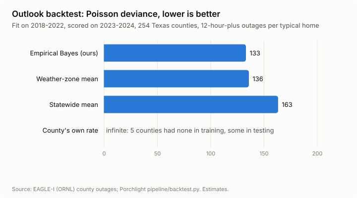
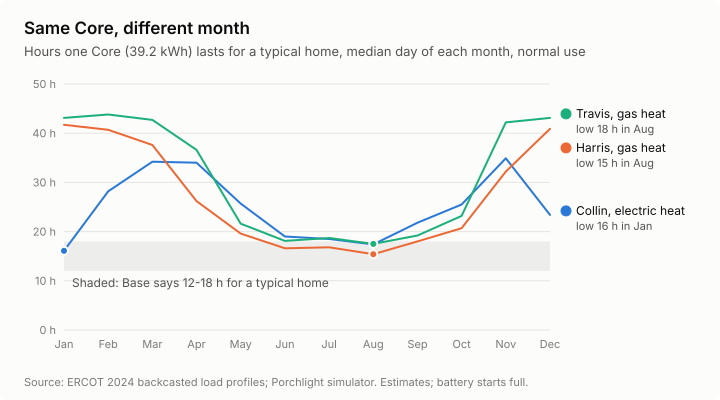
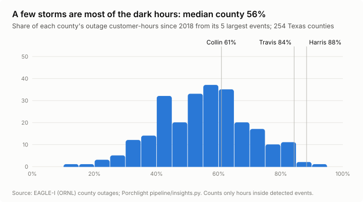

# Porchlight

**Will my lights stay on?** Type a Texas address and Porchlight answers from real public grid data:
how often homes in your county lose power and for how long, what a Base Core would have done in the
storms that actually hit, how many hours of backup you'd get in each month, and whether one Core or two
fits. A second screen shows Base's sales team which utilities and counties are under the most stress.

Built for the Base Power x AITX hackathon by Christian, Victor, Nolan and Alejandro.

<!-- TODO: 60-second GIF of Sally's report -->

## In 60 seconds

- **Real outage history.** Every 15-minute county outage reading in Texas, 2018-2025 (ORNL EAGLE-I), turned into events with a duration band per home.
- **Real storms, replayed.** Uri, Beryl, the 2023 ice storm and the 2024 derechos, run against a 39.2 kWh Core on ERCOT's measured household load for those exact days.
- **An honest outlook.** 12-hour-plus outages per typical home, fit per county with empirical Bayes and backtested against simpler forecasts.
- **A guarded narrator.** The LLM writes the summary but never calculates; a validator rejects any number it can't trace to a fact.
- **Where a Core pays twice.** Utility and county stress map built from EIA-861, FEMA NRI, ACS and ERCOT prices.

## Results

<!-- TODO: fill from the pipeline before submitting -->

| | |
|---|---|
| Outlook backtest | see `data/processed/backtest.json` and [MODEL_CARD.md](MODEL_CARD.md) |
| Narrator eval pass rate | 96% first reply, 100% after one retry, 24 fixtures ([Narrator evals](#narrator-evals)) |
| Report latency (p95) and load test | TODO (Victor) |
| Persona numbers hand-checked against raw data | [docs/persona-check.md](docs/persona-check.md) |

## Data

`make data` downloads every public source and rebuilds everything derived. Sources, licenses, as-of
dates and known limits are in [docs/DATA_SOURCES.md](docs/DATA_SOURCES.md). Outage data is county-level, so the
app says "homes in your county", never "your home". Every number on screen is labeled an estimate.

## What we'd do in week two

<!-- TODO: from docs/NEXT.md -->
- A Smart Meter Texas upload so the home's own 15-minute usage replaces the profile.
- The sales map's fleet overlay and storm replay; detailed flood outlines and wildfire.
- Utility-level outage feeds to replace the county-level EAGLE-I archive.

---

## Running the web app

Progressive web app with two experiences:

1. **Homeowner risk analysis** — account → stepped onboarding → location-based planning
2. **Provider CRM** — manage leads that come from risk analysis planning

Built with **Next.js**, **shadcn/ui**, **Mapbox GL**, and **Three.js**.

## Getting started

```bash
cp .env.example .env.local
# add NEXT_MAPBOX_ACCESS_TOKEN and Supabase keys to .env.local

npm install
npm run dev
```

### Supabase setup

1. Create a project at [supabase.com](https://supabase.com)
2. Copy **Project URL** and **publishable/anon key** into `.env.local`
3. Run `supabase/migrations/20260326000000_profiles.sql` in the SQL editor
4. In Auth → Providers → Email, enable email OTP (password login is not used)
5. In Auth → Email Templates → **Magic Link**, include the code so users can type it in:

   ```html
   <p>Your Base Power code is: <strong>{{ .Token }}</strong></p>
   ```

6. Configure **Mailgun** as custom SMTP (required — built-in email is capped at ~2/hour):
   1. In Mailgun: verify a sending domain → **Sending → Domain settings → SMTP credentials** → create/copy user + password
   2. In Supabase: **Authentication → SMTP Settings** → enable custom SMTP:

   | Field | Value |
   | --- | --- |
   | Sender email | e.g. `noreply@yourdomain.com` (must be on the verified Mailgun domain) |
   | Sender name | `Base Power` |
   | Host | `smtp.mailgun.org` |
   | Port | `587` |
   | Username | Mailgun SMTP login (often `postmaster@mg.yourdomain.com`) |
   | Password | Mailgun SMTP password |

   3. After saving, raise the email rate limit under **Authentication → Rate Limits** if needed (custom SMTP defaults around 30/hour)

Auth protects `/onboarding`, `/risk`, and `/crm`. Sign-in lives at `/` and uses emailed one-time codes.

Open [http://localhost:3000](http://localhost:3000).

## Containers

```bash
docker compose up --build
```

| Service | Port | Health |
| --- | --- | --- |
| web | 3000 | `GET /api/health` |
| api | 4000 | `GET /health` |
| worker | — | `GET /health` inside the container |
| postgres | 5432 | `pg_isready -U postgres -h localhost` |
| redis | 6379 | `redis-cli ping` |

Local Postgres uses Supabase’s defaults: user `postgres`, password `postgres`, database `postgres`.

## Product flow (scaffold)

| Area | Routes |
| --- | --- |
| Sign in | `/` (also `/sign-in` → redirects here) |
| Sign up | `/sign-up` |
| Onboarding | `/onboarding` → address → household → goals |
| Risk analysis | `/risk` |
| Provider CRM | `/crm`, `/crm/leads`, `/crm/leads/[id]` |

The app opens on the login screen. Onboarding captures address, household details, and backup battery goals. Auth and persistence are stubbed so the stepped UX can be walked end-to-end.

## Scripts

| Command | Description |
| --- | --- |
| `npm run dev` | Start development server |
| `npm run build` | Production build |
| `npm start` | Serve production build |
| `npm run lint` | ESLint |

## Project layout

```
src/
  app/
    (auth)/            # sign-in (/) + sign-up
    (consumer)/        # onboarding + risk analysis
    crm/               # provider CRM
  components/
    auth/
    onboarding/
    crm/
    layout/
    map/
    ui/
  lib/
    types/             # shared domain models
    onboarding/        # step config + option catalogs
    crm/               # mock leads for CRM scaffold
    map/
```

## Narrator evals

The report summary is written by Grok (`grok-4.20-0309-non-reasoning`, xAI) from a list of facts.
The model never calculates. Every number it writes must match a fact it cites, carry that fact's
unit, and keep its meaning: hours on one Core cannot be written as two Cores, and the long-outage
rate must say it is for 12-hour-plus outages. Banned phrases, a reading grade of 7 or lower, and
length caps are also checked. A failing reply gets one retry with the reasons, then a deterministic
template. Details are in [MODEL_CARD.md](MODEL_CARD.md).

24 fixtures (8 counties, one per ERCOT weather zone, by 3 homes). Median model time 2.6 s per report.
Latest recorded run:

| Source | Cases | Passed | Pass rate |
|---|---|---|---|
| Grok, first reply | 24 | 24 | 100% |
| Grok, after one retry | 24 | 24 | 100% |
| Template fallback | 24 | 24 | 100% |

Across runs the first reply has passed 92-100% and the retried reply 96-100%. Whatever fails
both tries falls back to the template, so the page never shows unvalidated text.

```
echo "XAI_API_KEY=..." > .env     # gitignored
python -m evals.record            # records evals/recorded/<model>/ and <model>+retry/
python -m evals.score             # writes evals/results.md
```

## Insights

Exported by `python -m pipeline.charts` into `public/insights/`. The numbers behind them are in
`data/processed/backtest.json`, `insights.json` and `data/features.duckdb`.






