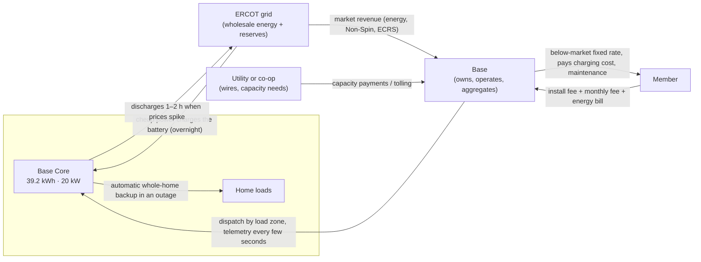

# Base Power battery: specs, economics and grid role

How a Base battery works end to end: what the hardware is, how long it backs up a home, how it lowers a member's bill, how it earns money supporting the ERCOT grid, and what utilities get from it. Written for the Porchlight team.

- **As of:** September 26, 2026. Facts come from Base's own public pages and help center, quoted and linked in [Sources](#sources).
- **Rule for the product:** this is a team reference, not copy. Base says pricing varies by address, and our `CLAUDE.md` says never hardcode prices. On screen, link to Base's pages for prices, and label every duration or power number an estimate.
- **Confidence:** where Base's own pages disagree, this doc says so. See [Conflicts and open questions](#9-conflicts-and-open-questions-for-base-engineers).

---

## The short version

1. **Base owns a 39.2 kWh battery (the Base Core) that it installs at a member's home.** The member pays a small install fee and a monthly membership instead of buying the battery. The battery is rated 20 kW.
2. **When the grid goes down, the battery switches the whole home over automatically** in about 50 ms. A typical Texas home gets about 12–18 hours from one Core, up to 36 hours if it cuts usage.
3. **When the grid is up, Base uses part of the battery to balance the grid.** Batteries charge when power is cheap, usually overnight, and discharge for short windows when demand and prices spike, usually hot afternoons. Base always keeps a backup reserve.
4. **That grid work is how Base makes money,** through ERCOT wholesale and reserve markets (including the ADER pilot, where Base is 71% of registered capacity) and through deals with utilities. Base says it earns most of its income from grid support.
5. **Grid revenue subsidizes the member's electricity rate.** In deregulated Texas, Base is also the member's electricity provider, with a fixed rate it guarantees is below the market average, and it pays for the battery's own charging.
6. **Utilities get dispatchable capacity in homes.** Base sells peaking capacity, fast deployment and distribution support, under a utility's own control through Base's dashboard or the utility's SCADA.

---

## 1. The hardware

### Base Core (current product)

| Spec | Value | Notes |
|---|---|---|
| Energy | **39.2 kWh** per Core; 78.4 kWh with two | "one of the largest home batteries available" |
| Power | **20 kW** | Stated on the utilities page ("residential BESS (20 kW / 39.2 kWh)") and as the load limit for backup to start. Not on the consumer spec sheet. |
| Chemistry | Lithium iron phosphate (LFP) | Safer and more stable than nickel-based chemistries; has active fire suppression |
| Switch to backup | "Seamless (50 milliseconds)" | Other Base pages say under 0.5 s, under 1 s, or 1–2 s; see conflicts |
| Voltage and frequency | 120/240 V, 60 Hz | Standard US split-phase: backs up both 120 V and 240 V circuits |
| Operating temperature | −22 to 122 °F | |
| Water | IP67 submersion to 3 ft, IPX9K high-pressure water, flash-flood tested | |
| Noise | 55 dBA at 1 m | "About the same as a refrigerator hum" |
| Size | 35.9 in H × 30.68 in W × 22 in D | Weight not published |
| Certifications | UL 1973, UL 9540, UL 991, UL 1998, UL 1741, IEEE 1547-2003 | |
| Main panel | 100–200 A main breaker (150–200 A in Austin); 200 A for two batteries | "Base systems only support up to 200 amps" |
| Generator port | NEMA L14-30R, recharges at **4 kW** (240 V generator) or 2 kW (120 V) | Standard on new Cores at no extra cost (older help articles say $1,000 and 3 kW) |
| Solar | Works with AC-coupled solar; excess solar charges the battery | Not compatible with an existing home battery |
| Lifetime and term | 12-year battery agreement | Base maintains and replaces it for the term |
| Ownership | **Base owns the battery** | "We don't sell batteries" |
| Made in | Austin, Texas ("Base Factory 1") | |

### Older systems (still in the field)

| System | Energy | Power | Typical duration | Notes |
|---|---|---|---|---|
| Wall-mounted | 20 kWh (18 usable) | 10 kW | 6+ h | Spec sheet PDF |
| Ground-mounted | 25 kWh (22.5 usable) | 11.4 kW (11 kW inverter) | 8–12 h typical, up to 24 h reduced | Battery pack + inverter + hub |
| 2× ground-mounted | 50 kWh (44 usable) | 11.4 kW | 30+ h | El Paso Electric's pilot still installs two 25 kWh units |

**Why this matters for us:** the "11 kW" figure in several help articles (and in our appliance JSON) belongs to these older 25 kWh systems. For the Core, Base says 20 kW.

---

## 2. Power vs. energy (the part that confuses everyone)

- **kWh (energy) is the tank.** 39.2 kWh is how much a Core stores. It sets **how long** backup lasts.
- **kW (power) is the pipe.** 20 kW is how much the Core can deliver at once. It sets **what can run at the same time**.
- **Hours of backup ≈ usable kWh ÷ average load in kW.** At 1.5 kW average, 39.2 kWh lasts about 26 hours in theory. Base quotes 12–18 hours "typical" because real homes vary through the day, AC and heat cycle, and some energy is held back or lost in conversion.
- **Starting limit:** backup only turns on if the home is using under 20 kW at the moment the grid fails (11 kW on the older units). If load is too high, the member turns big loads off and the battery engages.
- **Motor surges:** AC compressors with a locked-rotor current (LRA) under 160 A start automatically; bigger ones may need a soft starter.
- **Recharging during a long outage:** a portable generator adds up to 4 kW, and solar adds whatever it produces. Base's example: 39.2 kWh at 1.5 kW lasts **78 hours** with a generator topping it up.

Our appliance reference (`src/lib/backup/appliance-loads.json`) turns this into the "must stay on" math.

---

## 3. How long backup lasts

Base publishes several duration figures. They're consistent once you see the load behind each.

| Home load | One Core (39.2 kWh) | Source |
|---|---|---|
| Low (about 750 W) | 22–36 h | Help center |
| Average (about 1.5 kW) | 12–18 h | Help center; also "typical" on the spec sheet |
| High (about 4 kW) | 4–6 h | Help center |
| Very high (about 8 kW) | 2–3 h | Help center |
| Reduced use | "Up to 36 hours" | Spec sheet |
| Generator recharging, 1.5 kW load | 78 h | Help center |

- **Headline claim:** "Approx. 36–72 hours (1–2 batteries)". This is the **reduced-use** figure. For a typical home, one Core is 12–18 hours. The duration calculator page says "~12–36 hours" for 39.2 kWh and "~24–72 hours" for 78.4 kWh.
- **What we should say on screen:** "about 12–18 hours for a typical home, up to 36 hours if you cut back", and let our own simulator (ERCOT load profiles by month) do the rest. Our `CLAUDE.md` currently lists "about 36–72 h for 1–2 Cores" as an allowed fact; that's Base's reduced-use headline, not a typical number.
- **Context:** Base says the average Texas outage lasts 2.5 hours and that its reserve covers about 97% of outages. The long tail (storms like February 2021 or Hurricane Beryl in July 2024) is exactly where Porchlight's replay adds value.

---

## 4. How the battery saves homeowners money

### The mechanisms

1. **Grid revenue lowers the rate.** "When demand surges, our battery fleet gets paid to support the grid. This means lower prices for everyone on a Base plan." Base says it "earns most of its income from grid support".
2. **Fixed, below-market rate.** In deregulated Texas, Base is the member's Retail Electric Provider (PUCT license #10338). The agreement "legally guarantees your rates stay below the market average" and renewals are priced below market too.
3. **No battery purchase.** The member pays a one-time install fee instead of buying hardware. Base compares its $695 install to about $13,000 for a whole-home generator, and says matching the storage from a leading brand runs about $35,000 installed.
4. **Base pays for the battery's charging.** Energy used to charge the battery is credited back on the bill ("Battery Credit Energy Charges"), so members only pay for what their home uses.
5. **Avoided outage costs.** Spoiled food, hotel nights, a generator and fuel. Base doesn't quantify these; Porchlight's outage history can.
6. **Solar members:** Base buys back 100% of excess solar at 4¢/kWh where buyback is offered.

### What members pay (published examples, deregulated Texas)

Prices vary by address and change over time. These are Base's published examples as of September 26, 2026, for reference only.

| Plan | Energy rate | Install | Monthly | Term |
|---|---|---|---|---|
| Energy + one Core, Oncor | 13.9¢/kWh all-in (7.7¢ energy + delivery) | $695 | $19 | 36 months |
| Energy + one Core, CenterPoint | 13.1¢/kWh all-in | $695 | $19 | 36 months |
| Energy + two Cores | area rate | $995 | $29 | 36 months |
| Energy only, Oncor | 14.2¢/kWh | none | none | 36 months |

- All-in rates are quoted at 2,000 kWh a month.
- There's a $50 refundable deposit, credited toward the install fee.
- The battery agreement is 12 years, with a $500 deinstallation fee. **A member must keep Base as their electricity provider to keep the battery.**
- Base covers early-termination fees from a previous provider: $250 on battery plans, $150 on energy-only.
- The core page claims "~13.8% avg. savings vs. market rates".

**Utility and co-op areas work differently.** The utility stays the electricity provider and Base only adds the battery:
- Austin Energy: $695 + $19/month, and "Base does not charge you for energy"
- CoServ: $345, $0/month
- GVEC: $295, $0/month
- Farmers EC: $695, $0/month
- El Paso Electric pilot: pays the homeowner $250 per battery
- Illinois (ComEd): $95 install, time-of-use rates at least 25% below ComEd's price to compare

### The bill study (what it does and doesn't show)

Base analysed 7,148 bills from 4,478 Texans (May 2026), matched against ERCOT data.
- Non-switchers pay a median 16.0¢/kWh, versus 14.0¢ for people who switched 7+ times: about $307 a year at 1,706 kWh a month.
- The six largest providers charge a median 16.4¢, versus 13.9¢ for the six smallest.
- It measures **retail rate shopping**, not battery savings. The sample came through Base's own comparison tool and "may not be representative". Use it as context for "will I save?", which Base already owns. Porchlight's wedge is "will my lights stay on?"

---

## 5. How the battery supports the grid (and earns money)

### The daily cycle

- **Charge when power is cheap:** "charges when energy is cheap — like overnight".
- **Discharge when the grid is stressed:** software "detects spikes in demand through price surges". Windows are "typically mid-to-late afternoon on hot Texas days" and brief, **1–2 hours**, followed by a quick recharge.
- **Never during an outage:** "our batteries will never discharge to the grid during an outage."
- **Before storms:** "The battery holds more charge and pulls back from grid activity." Base monitors weather and forecasts outages.
- **Base's preferred term** is "grid-balancing", not "energy trading".

### The reserve (backup always comes first)

Base describes the reserve in several ways:
- "we keep a reserve of 20%" (about 7.8 kWh on a Core)
- "batteries never drop below 20%, and it's rare that they ever even fall below 50%"
- "at least 5 hours (single battery) … of backup at low energy usage", covering about 97–97.5% of outages
- "minimum guaranteed charge covers 4 hours at low usage"

Grid dispatch "draws from available capacity above that reserve." Base doesn't publish what share of capacity it dispatches. For our simulator, the conservative assumption is that an outage nobody saw coming starts at **the reserve floor (20%)**. For a forecast storm, it starts near **full**, because Base pulls back ahead of weather.

### Where the money comes from: ERCOT

- **Wholesale energy:** buying low overnight and selling during price spikes. Each load zone's aggregation is settled at that zone's real-time price.
- **Reserves (ancillary services):** Base names **Non-Spinning Reserve** and **ERCOT Contingency Reserve Service (ECRS)**.
  - *General definitions (check ercot.com before quoting):* ECRS is a fast reserve ERCOT holds for sudden drops in supply or quick ramps in demand. Non-Spin is slower backup capacity ERCOT can call within about 30 minutes. ERCOT pays resources to stand ready, whether or not they're called.
- **Utility contracts:** see section 6.

### ADER: how thousands of home batteries act like one power plant

ERCOT's **Aggregated Distributed Energy Resource (ADER)** pilot lets many small devices take part in the wholesale market as one resource.

- **Scale:** "Base constitutes 103 of 145 total MW registered ADER participants, or 71% of the program." In August 2026 the fleet was 205.5 MW, 39% of it enrolled in ADER (North 22.9, South 7.2, Houston 50.5 MW, plus 30 MW pending). Base was energizing about 2 MW a day.
- **How it's dispatched:** "one resource is formed per loadzone, and is dispatched every 5 minutes by ERCOT's" security-constrained economic dispatch (SCED), "settled according to the loadzone price."
- **Getting a home into the market** takes six steps: installation, registration, interconnection, telemetry (ICCP link to ERCOT), qualification, then ancillary services. That's about **60 days** from install to participating in SCED.
- **Metering:** devices send real-time telemetry, but "settlement is still the responsibility of the premise meter."
- **Accuracy:** "within 3.3% of commanded power on average", against ERCOT's 15% tolerance. That's the kind of number that makes a utility trust a fleet of home batteries.
- **The "capacity crunch" argument:** ERCOT set a load record of 91 GW. Base says it deployed the equivalent of "a 200 MW grid-scale battery" in about 6 months, versus about 3 years for a grid-scale project.
- **What's next:** proposed ADER Phase IV would recognize aggregations **nodally** (by transmission point), so home batteries could relieve local congestion. Base cites a study where about 80 MW of aggregated batteries fully relieves constraints at one substation (Burleson Switch).

**Porchlight connection:** the playbook's "Pays twice" and the sales map use load-zone prices because that's how ADER settles today. Real siting needs nodal studies, which is what Phase IV points toward.

---

## 6. What utilities get

From Base's utility partnerships page:
- **Three offers:**
  - bulk peaking capacity
  - speed to power (fast deployment)
  - distribution grid support
- **Fleet performance:**
  - "24/7 dispatchable up to 500 cycles a year"
  - 96% fleet availability
  - under 5% forced outage rate
- **Control:** "Utilities maintain full dispatch rights 24/7/365", through Base's operators dashboard or the utility's own energy management system or SCADA.
- **Commercial models:**
  - tolling Base-owned batteries
  - pay-for-performance
  - build-transfer
- **Scale:**
  - "3 metro areas, 6 utility partners"
  - $2.5B raised toward 20 GWh of manufacturing capacity
- **How the programs look:**
  - **Co-ops** (CoServ, GVEC, Farmers EC, Bandera EC): the co-op "can draw on the battery to add capacity during high demand hours". Members see it as a bill credit (CoServ's "Reliability Plus Participation Credit", GVEC's "Renewable Energy Credit").
  - **Austin Energy:** the battery sits **in front of** the member's meter, and Base doesn't charge for energy.
  - **El Paso Electric** (outside ERCOT, on the Western grid): a pilot for the first 500 homes that pays the homeowner.

**For the sales map:** its pitch ("here's where your grid is stressed") lines up with these offers. The fleet slider's "peak support up to X MW" uses 20 kW per Core, the figure Base gives utilities, labeled as an upper bound.

---

## 7. The money loop, end to end

| Who | Pays | Gets |
|---|---|---|
| **Member** | Install fee, monthly membership, energy at a fixed rate | Whole-home backup, a below-market rate, maintenance, charging paid by Base |
| **Base** | Hardware (it owns it), install, maintenance, charging energy, member credits | Retail margin on energy, ERCOT market revenue (energy + reserves via ADER), utility capacity contracts |
| **ERCOT market** | Real-time prices and reserve payments | Fast, dispatchable capacity at peak |
| **Utility or co-op** | Capacity or tolling payments | Peak capacity, distribution support, faster than building plants |

Base doesn't publish how its revenue splits between retail margin, arbitrage, reserves and utility contracts. Treat any split as a question for Base.

---

## 8. What this means for Porchlight

1. **Power limit:** use **20 kW per Core** for the Base Core, the figure Base gives utilities and the load-to-start threshold. The 11 kW / 22 kW figures belong to the older 25 kWh units. Update `src/lib/backup/appliance-loads.json` (which lists both) and close the related open question in the playbook.
2. **Duration on screen:** say "about 12–18 hours for a typical home, up to 36 hours with reduced use" per Core, then show our simulator's month-by-month numbers. Update the "36–72 h" line in `CLAUDE.md` to make clear it's reduced use.
3. **Starting charge in the simulator:** full for forecast storms (Base pulls back ahead of weather), and the 20% floor as the "nobody saw it coming" case. That matches the toggle already planned in M-01.
4. **Words:** "grid-balancing", not "trading"; "member", "Core"; estimates everywhere.
5. **Sales-map fleet math:** MWh = homes × 39.2 kWh; MW = homes × 20 kW, labeled "up to". Settlement is by load zone today, nodal later (Phase IV).

---

## 9. Conflicts and open questions for Base engineers

1. **Power:** is 20 kW continuous output, peak, or only the load-to-start limit? Is two Cores 40 kW? Some help articles still say "11 kW" without naming a model, and one says the 39.2 kWh battery has an "11 kW inverter".
2. **Duration headline:** "36–72 hours (1–2 batteries)" vs. "typical 12–18 hours" on the spec sheet, and "24–72 hours" for two batteries on the calculator.
3. **Reserve floor:** 20% state of charge, "5 hours at low usage", or "4 hours at low usage"? Coverage is quoted as 97% and 97.5%.
4. **Switch time:** 50 ms (spec sheet), under 0.5 s, under 1 s, or 1–2 s (comparison tables).
5. **Generator port:** "no additional cost, 4 kW" (new page) vs. "$1,000, 3 kW" (older help articles).
6. **Lifetime:** 12 years (Core agreement) vs. 10, 10–15 or 15 years on older pages.
7. **Revenue split:** how much comes from energy, reserves, utility contracts and retail margin? What share of fleet capacity is dispatched in a typical week?
8. **Metering:** Texas deregulated homes are behind the meter; Austin Energy is in front of the meter; Illinois shows a "Battery Dispatch Credit". Which setup should our models assume?
9. **Before-storm behavior:** how far ahead does Base pull back, and to what charge level?

---

## 10. Glossary

| Term | Meaning |
|---|---|
| **kW / kWh** | Power (rate) vs. energy (amount). 1 kW for 1 hour = 1 kWh. |
| **State of charge (SoC)** | How full the battery is, in percent. |
| **Reserve** | Charge Base never uses for the grid, kept for outages. |
| **ERCOT** | The grid operator for about 90% of Texas load. Runs the wholesale market. |
| **REP** | Retail Electric Provider: sells electricity to homes in deregulated Texas. Base is one. |
| **TDSP / utility** | The wires company (Oncor, CenterPoint, AEP Texas, TNMP) that delivers power and handles outages. |
| **Load zone** | ERCOT pricing region (Houston, North, South, West, plus Austin and San Antonio). ADER settles by zone. |
| **SCED** | ERCOT's dispatch engine, run every 5 minutes, which tells resources how much to produce. |
| **ADER** | Aggregated Distributed Energy Resource: many small devices bid into ERCOT as one resource. |
| **Ancillary services** | Reserves ERCOT pays to keep ready (Base names Non-Spin and ECRS). |
| **Arbitrage** | Charging when power is cheap and discharging when it's expensive. Base calls it grid-balancing. |
| **Nodal** | Pricing or dispatch by specific grid location (bus or substation) instead of by zone. |
| **Behind / in front of the meter** | Whether the battery sits on the home's side of the meter (most Base homes) or the utility's side (Austin Energy). |
| **BESS** | Battery energy storage system. |

---

## Sources

Base Power pages, read September 26, 2026:
- Base Core product page: https://www.basepowercompany.com/core
- Base Core spec sheet: https://www.basepowercompany.com/specs/core
- Ground-mounted spec sheet: https://www.basepowercompany.com/specs/ground-mounted
- Spec comparison (PDF, older systems): https://www.basepowercompany.com/specs-comparison
- How it works: https://www.basepowercompany.com/how-it-works
- Energy service: https://www.basepowercompany.com/energy
- Oncor and CenterPoint plans: https://www.basepowercompany.com/oncor, https://www.basepowercompany.com/centerpoint
- Utility partnerships: https://www.basepowercompany.com/utilities
- Austin Energy program: https://www.basepowercompany.com/austinenergy/how-it-works
- Co-op and pilot programs: https://www.basepowercompany.com/coserv, /gvec, /farmers, /epelectric
- Illinois: https://www.basepowercompany.com/illinois
- With solar: https://www.basepowercompany.com/with-solar
- With a generator: https://www.basepowercompany.com/with-generator
- Duration calculator: https://www.basepowercompany.com/duration-calculator
- Battery guide: https://www.basepowercompany.com/blog/base-battery-guide
- How Base charges and discharges: https://www.basepowercompany.com/blog/how-base-charges-and-discharges-its-batteries
- How grid-balancing works: https://www.basepowercompany.com/blog/how-grid-balancing-works
- ADER Phase IV and the capacity crunch: https://www.basepowercompany.com/blog/aggregated-ders-and-the-capacity-crunch
- Bill study: https://www.basepowercompany.com/blog/bill-study
- Site index for agents: https://www.basepowercompany.com/llms.txt

Base help center (https://help.basepowercompany.com/en/articles/ID):
- 10195585, 10627905: backup power limits (11 kW older units, under 20 kW for Core)
- 10195777, 10196033: backup duration by usage level
- 10282817: generator recharging and run times
- 10283649, 10639297: backup reserve and dispatch windows
- 10283073, 10283137: battery agreement, ownership, renewal
- 10311745: Base pays for battery charging
- 10280705: panel requirements
- 12867073: AC motor start (LRA)
